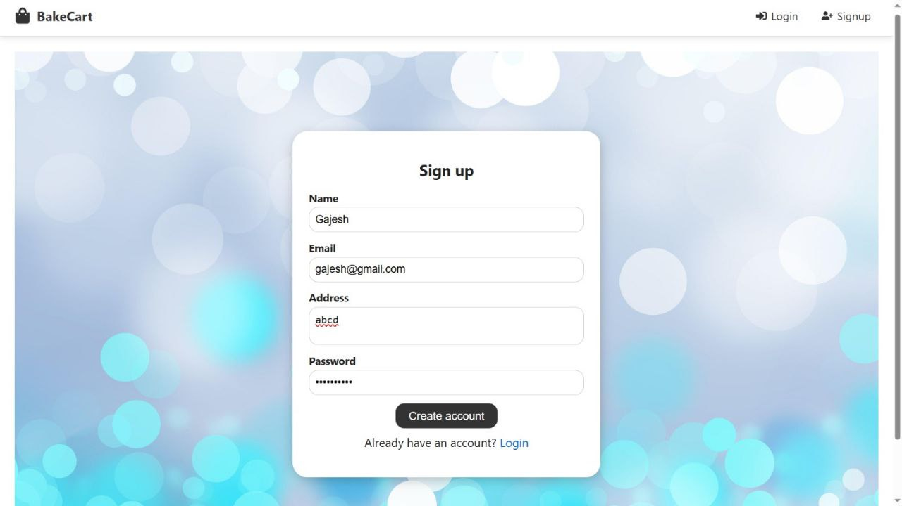
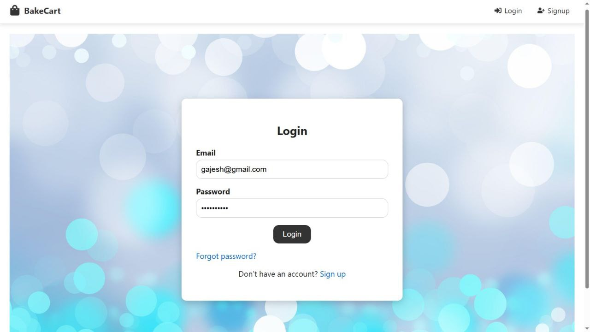
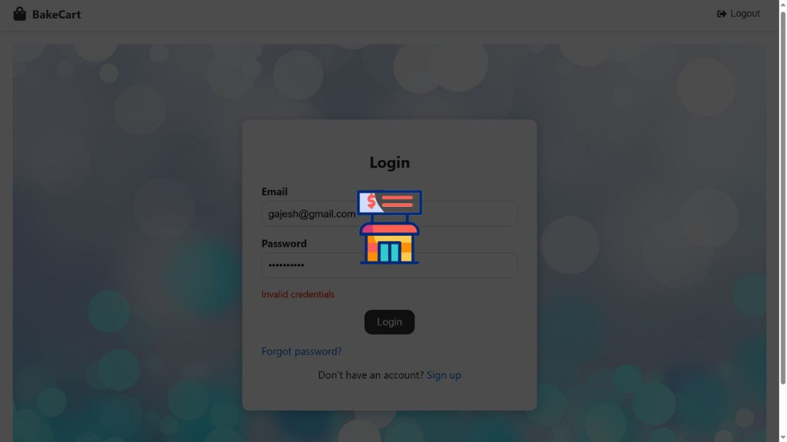
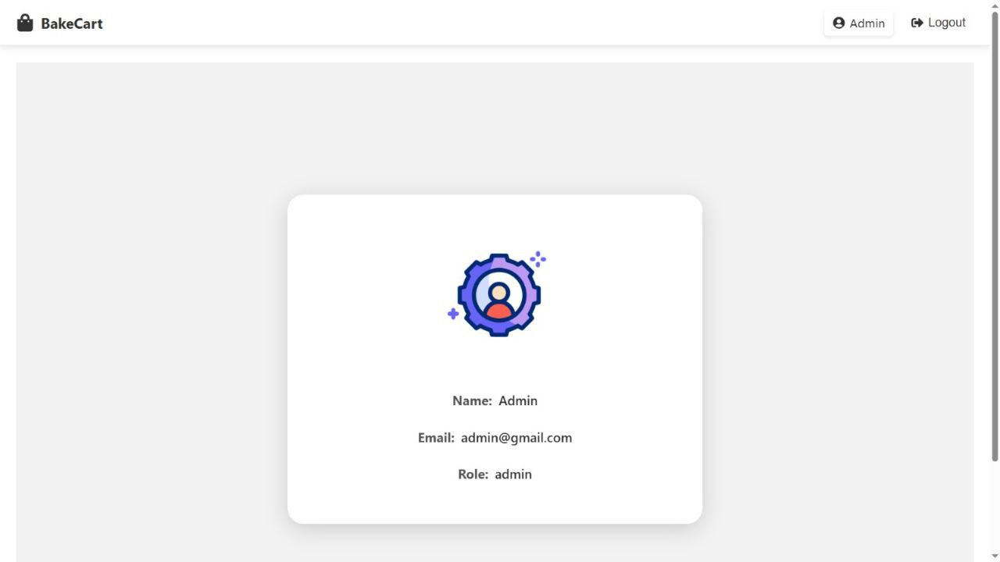
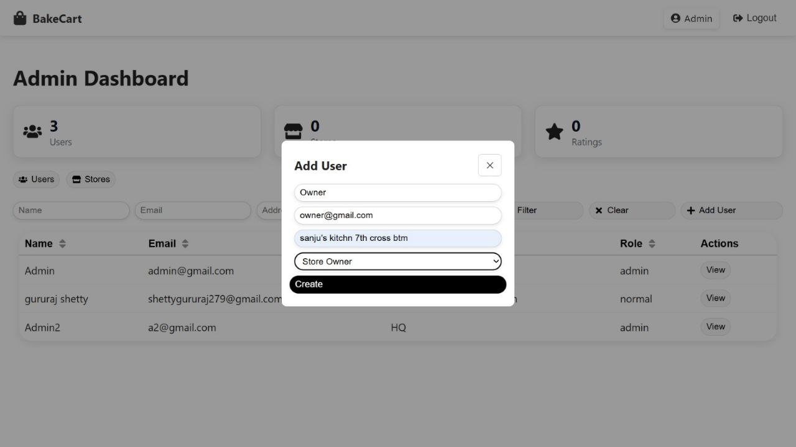
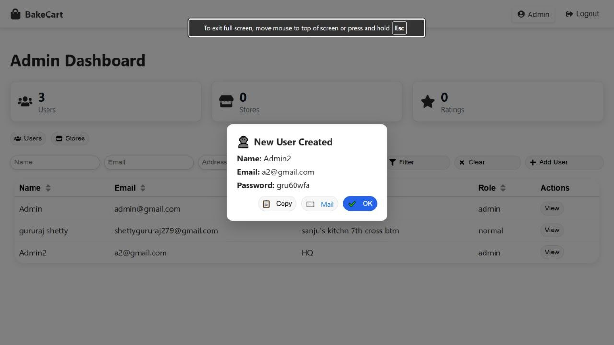
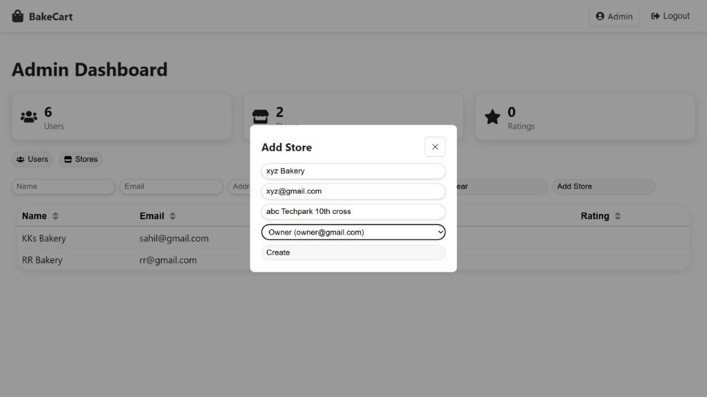
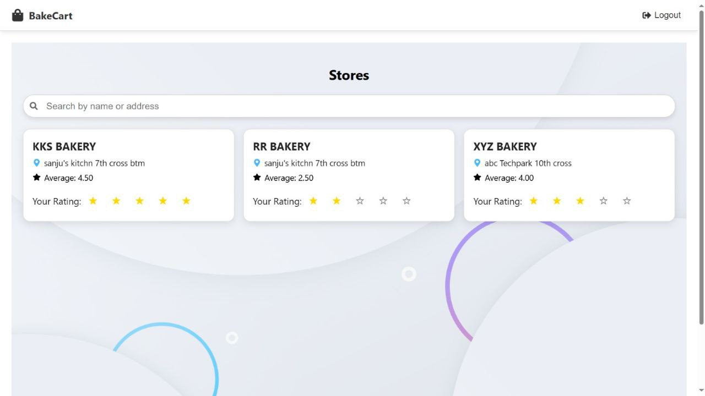
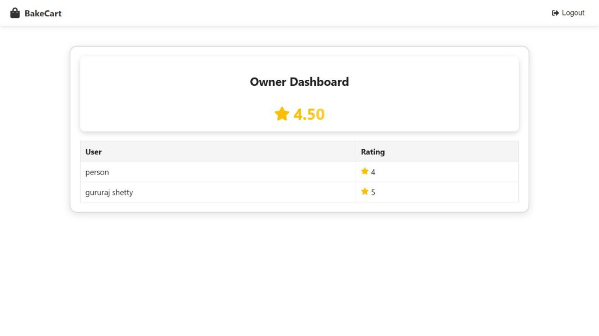
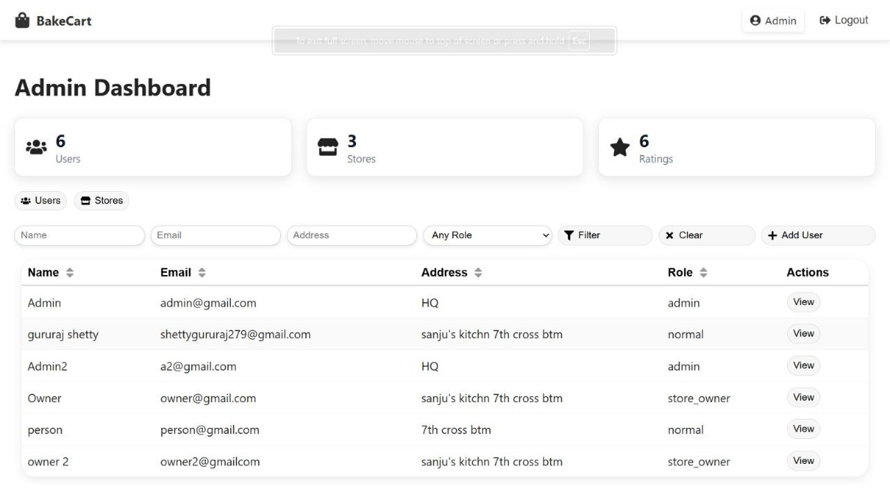

# 🍞 BakeCart Frontend

The frontend for **BakeCart**, a bakery store listing and ordering platform.  
Built with **React**, **React Router**, and API integration with the backend.

---

## 🚀 Features
- User authentication (Login, Signup, Forgot/Reset Password)
- Store listing with search and ratings
- Animated, responsive UI with hover effects
- Conditional links based on user role (admin, user)
- Profile management
- Integration with REST API

---

## 📦 Tech Stack
- **React 18**
- **React Router v6**
- **Axios** for API requests
- **React Icons** for UI icons
- **Custom CSS / Tailwind CSS** for styling

---

## 🔧 Installation

1. Navigate to the frontend folder:
   ```bash
   cd frontend


2. Install dependencies:

   ```bash
   npm install
   ```

3. Start development server:

   ```bash
   npm start
   ```

---

## ⚙️ Environment Variables

Create a `.env` file inside `frontend/` with:

```env
REACT_APP_API_URL=http://localhost:5000/api
```

---

## 📂 Project Structure

```
frontend/
 ├── public/              # Static assets
 ├── src/
 │   ├── api/              # API calls
 │   ├── components/       # Reusable UI components
 │   ├── pages/            # Route pages
 │   ├── hooks/            # Custom hooks
 │   ├── App.js            # Main App component
 │   └── index.js          # Entry point
 └── package.json
```

---

## 🧪 Testing

```bash
npm test
```

---

## 📜 Scripts

* `npm start` – Start dev server
* `npm run build` – Create production build
* `npm test` – Run tests

---

## 📸 Screenshots

### SignUp Page




### Login Page




### Loading Page




### Profile Page




### Add User




### User Created




### Add Store




### User Page




### Owner Page




### Admin Dashboard




## ✨ Author

Developed by **Gururaj**


